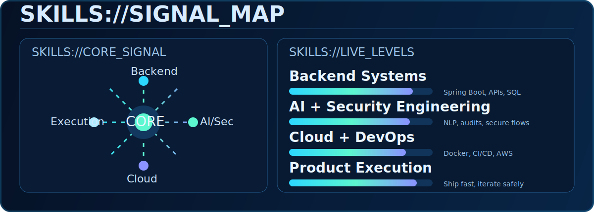

 

`Shipping secure AI features with production-grade backend systems.`

 

---

## RECRUITER://SNAPSHOT

| Signal | Current Status |
| --- | --- |
| `Location` | Chicago, IL |
| `Education` | Illinois Institute of Technology - BS CS (May 2026) |
| `Target` | Full-Time Software Engineer Roles (2026) |
| `Core Focus` | Secure AI + scalable backend systems shipped to production |

---

## IMPACT://HIGH_SIGNAL

- Cut release process time from **4 hours to 15 minutes** by automating deployment workflows.
- Built phishing-defense tooling with **92% detection accuracy** and **84% fewer risky clicks**.
- Mentored **100+ students** in systems programming and Java OOP fundamentals.

---

## SKILLS://SIGNAL_MAP

---

## SKILLS://PROOF_MATRIX

| Skill Cluster | Evidence | Outcome | Proof |
| --- | --- | --- | --- |
| `Backend Systems` | Designed API-first services and data workflows across portfolio and engineering projects. | Faster feature delivery with stable interfaces and cleaner integrations. | [Musharaf-Portfolio](https://github.com/Apple-beep/Musharaf-Portfolio) |
| `AI + Applied ML` | Built resume-intelligence workflows for candidate analysis and explainable scoring. | Practical AI features aligned with product decisions and user trust. | [hirelens](https://github.com/Apple-beep/hirelens) |
| `Security Engineering` | Developed browser-side phishing checks and risk-aware URL analysis workflows. | Reduced unsafe interactions and improved defensive user behavior. | [CheckUrl-ext](https://github.com/Apple-beep/CheckUrl-ext) |
| `Data + SQL` | Built optimized analytics pipelines over racing datasets with query-focused modeling. | Better performance and insight extraction from structured data. | [f1-database-management-system](https://github.com/Apple-beep/f1-database-management-system) |
| `Product Execution` | Shipped accessibility and UX-driven application experiences for real users. | Stronger delivery quality from concept to implementation. | [VisionVoice](https://github.com/Apple-beep/VisionVoice) |

---

## FOUNDATION://PHASE_1_STATUS

- GitHub Pages deployment pipeline is active via Actions.
- Project site is live at: <https://apple-beep.github.io/Apple-beep/>
- Health checks run weekly and on relevant pushes.
